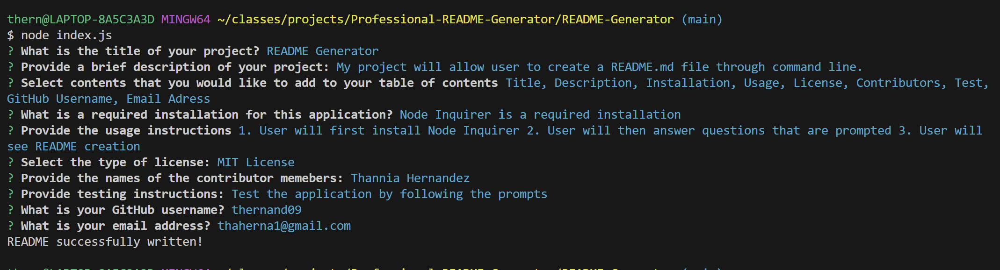

## Table of Contents
* [User Story](#user-story)
* [Acceptance Criteria](#acceptance-criteria)
* [Usage](#usage)
* [Try Outs](#try-outs)
* [Screenshots](#screenshots)

## User Story

```md
AS A developer
I WANT a README generator
SO THAT I can quickly create a professional README for a new project
```

## Acceptance Criteria

```md
GIVEN a command-line application that accepts user input
WHEN I am prompted for information about my application repository
THEN a high-quality, professional README.md is generated with the title of my project and sections entitled Description, Table of Contents, Installation, Usage, License, Contributing, Tests, and Questions
WHEN I enter my project title
THEN this is displayed as the title of the README
WHEN I enter a description, installation instructions, usage information, contribution guidelines, and test instructions
THEN this information is added to the sections of the README entitled Description, Installation, Usage, Contributing, and Tests
WHEN I choose a license for my application from a list of options
THEN a badge for that license is added near the top of the README and a notice is added to the section of the README entitled License that explains which license the application is covered under
WHEN I enter my GitHub username
THEN this is added to the section of the README entitled Questions, with a link to my GitHub profile
WHEN I enter my email address
THEN this is added to the section of the README entitled Questions, with instructions on how to reach me with additional questions
WHEN I click on the links in the Table of Contents
THEN I am taken to the corresponding section of the README
```

## Usage


## Video


## Try Outs

I first install inquirer version 2.4.9 to my application. I then created an array of questions that will allow the application to ask user. Then function was added to index.js so a README.md file will be created. After index.js was completed I then added functions for that will return a license badge based on which license is selected in the generateMarkdown.js. Last but not least a function was added to generate markdown for README. After all tasks were completed then I test my application through my command line.

## Screenshots
Enter node index.js to command line

Answer question prompted

Watch README.md file be created!
